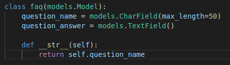
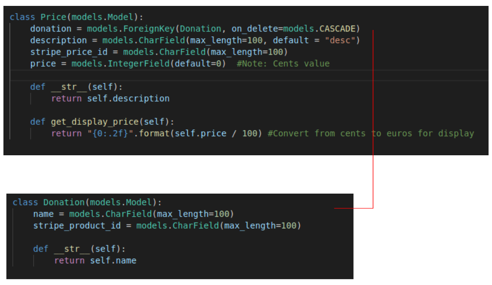
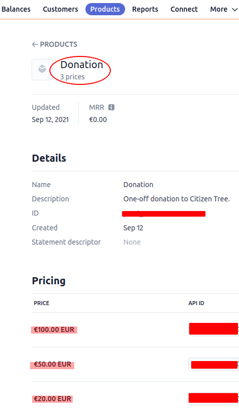
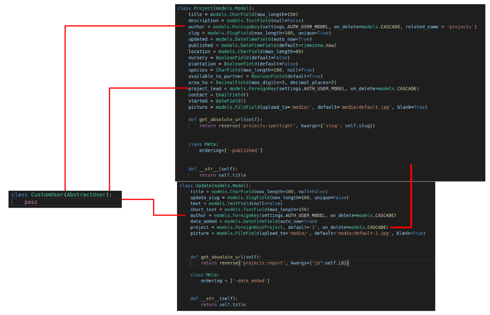

# Citizen Tree <!-- omit in toc -->
Citizen Tree is an online space to foster networks of people interested in growing trees to help one another brings trees from seed through to woodland. 

<a href="https://ms4-citizen-tree.herokuapp.com/" target="_blank">View the live project here</a>

# Table of Contents <!-- omit in toc -->  
- [Scenario Outline / Strategy](#scenario-outline--strategy)
- [User Experience](#user-experience)
  - [User Stories by User Type](#user-stories-by-user-type)
      - [Non-Registered Visitor](#non-registered-visitor)
    - [Registered Non-Contributing User](#registered-non-contributing-user)
    - [Registered Contributing User](#registered-contributing-user)
    - [Admin/Site-Owner](#adminsite-owner)
- [Design - UI](#design---ui)
- [Design - Database](#design---database)
    - [faq](#faq)
    - [Donations](#donations)
    - [Projects and Updates](#projects-and-updates)
      - [Using the Custom user Model](#using-the-custom-user-model)
- [Features](#features)
  - [Admin perspective](#admin-perspective)
    - [Email Verification](#email-verification)
    - [User Image Upload](#user-image-upload)
    - [Donations with Stripe](#donations-with-stripe)
  - [Initial Setup](#initial-setup)
    - [Based on Django for Professinoals by William S. Vincent](#based-on-django-for-professinoals-by-william-s-vincent)
  - [Set up static files](#set-up-static-files)
  - [Problem using docker-compose to install packages](#problem-using-docker-compose-to-install-packages)
  - [Class-based generic views](#class-based-generic-views)
  - [Calculator Page](#calculator-page)
      - [Cost of fuel in Ireland](#cost-of-fuel-in-ireland)
      - [Emissions from diesel/petrol](#emissions-from-dieselpetrol)
    - [Hazelnut orchards - sequestration (Italy)](#hazelnut-orchards---sequestration-italy)
    - [Agroforestry systems](#agroforestry-systems)
    - [Ireland:](#ireland)
    - [Planning woodland](#planning-woodland)
    - [UK](#uk)
    - [Calculator example](#calculator-example)
  - [Stripe](#stripe)
  - [Git](#git)
  - [Deployment](#deployment)
    - [Notes on Development](#notes-on-development)
      - [Why not use Gitpod?](#why-not-use-gitpod)
      - [Resources on Docker, Docker Compose, and Pipenv](#resources-on-docker-docker-compose-and-pipenv)
      - [Installing Docker](#installing-docker)
      - [Setting up the Virtual Environment and Managing Dependencies](#setting-up-the-virtual-environment-and-managing-dependencies)
      - [Using Docker Compose](#using-docker-compose)


# Scenario Outline / Strategy
The intended user of Citizen Tree falls broadly into one of two posible categories:
1. User with time and interest in growing trees but no space/land to do so.
   An example of this might be a school. As part of their learning about climate change, biodiversity etc, kids are introduced to the value of trees. Perhaps they visit a local forest on occasion. The kids would be interested in contributing to a tree-growing project but the school has no land to facilitate that. However, they do have space for 2-3 raised beds in which the kids could grow seeds to the seedling or one-year-old stage.At that point they would need to partner with a landowner to get those trees planted into a space where they could grow to maturity.
   Other potential users in this category might be individuals with small (or large) gardens, community groups, allotment groups, retirement groups, mens sheds etc.
2. User with space/land to grow trees but in need of help and/or trees. 
   The other side of the coin is the person or institution who owns some land and would like to have it planted with trees and are interested in community engagement. Maybe they don't have enough land to justify a commercial approach or perhaps they are just not interested in becoming commercial forestry owners. Rather they would be happy for a group of interested people to come and plant the land with them, for free, and provide the trees for free. It might also suit a company who has a land bank and sees the opportunity for devloping a positive profile using the partnerships facilitated bythe site.

The site aims to help foster connections between people in these two categories so that land might get planted and long-standing relationships might develop to help manage the trees and enjoy the spaces they create.

It also has a donation page where supporters can support the project financially.

# User Experience
Users envisaged for the site are as follows:
* An admin superuser who can see and edit all content on the site. When a new project joins, this person is required to give authoring rights to the designated 'author' for a project. This user is essentially the site owner and in a real world scenario would work together with a board to decide how donations were spent, whether requesting projects would be invited to join etc.
* A project coordinator/author who is responsible for maintaing the information for a project - whether the project details page or periodic updates for the project progress. The rights associated with this user are limited to authoring for a specified subset of projects and cannot be self-assigned.
* A general user with read-only access. Although this user may be registered with the site, and may be a member of a project that is affiliated with the site, they do not have authoring or upload rights. They can make donations and view all content.
* A non-registered visitor has very limited access. In order to view project details or make a donation, users are required to register. A non-registered visitor can use the calculator app without restriction.


## User Stories by User Type

#### Non-Registered Visitor
* As a first-time or non-registered vistor to the site, I have limited access to content and I cannot make a donation.
However, as an enticement to register and to set up a degreee of trust in the site and establish the scientific basis for the site's aims.
* I am encouraged to become a registered user because my access to site content is limited.
* I can interact with the CO2 calculator and get a sense of my personal CO2 emission (currently from transport fuel only) and how this might be counter-balanced by trees.
* I can clearly get a sense of the sites aims.
* The sites credibility is established by use of references and clear presentation of how claimed values are calculated.

### Registered Non-Contributing User
* I can access any content that is available to a non-registered user.
* In addition, I can access all content relating to projects on the site and any associated updates from those projects.
* I can make a donation.

### Registered Contributing User
* I have access to all content that a non-registered user has. 
* In addition, I can access all content relating to projects on the site and any associated updates from those projects.
* If my user has been designated the 'author' for one or more projects, I can update the information for a project and and can add/edit updates.

### Admin/Site-Owner
The interaction of this user with the site assumes integration with offline processes. For example, potential projects need to be vetted in person. Assuming this is all in place, the main points in relation to site use are:
* I can add a project and assign an 'author' - the designated person for a project to edit the project details page and add project updates.
* I can access information about donations and successfully accept donations from the public using a secure checkout.
* I can edit or delete any project or update content.

# Design - UI
Wireframes and initial mockups:

* [Desktop](docs/MS4_Desktop.pdf)
* [Mobile](docs/MS4_Mobile.pdf)
* [Initial Outline](docs/MS4Draft_InitialOutline.pdf)

# Design - Database
There are 5 models currently used in the app:

### faq
The faq model holds the content for the FAQs that a user accesses at the bottom of the calculator page. These are served using fetch (asynch) and the Django Rest Framework (the API endpoints from which fetch retrieves the data are set up using the Django Rest Framework (DRF)).



The following resources served as guidance for setting up DRF and fetch:

DRF:
* https://howtocreateapps.com/fetch-and-display-json-html-javascript/
* https://stackoverflow.com/questions/66318099/passing-django-model-properties-to-javascript-with-the-fetch-api
* https://www.pluralsight.com/guides/work-with-ajax-django
* https://www.geeksforgeeks.org/render-a-html-template-as-response-django-views/
* https://www.youtube.com/watch?v=DG4obitDvUA&list=PLBMLLI9khn4f1ydlbn3jsuvkf4HEmRtoX
* https://docs.djangoproject.com/en/3.2/topics/db/queries/
* https://stackoverflow.com/questions/65369567/import-rest-framework-could-not-be-resolved-but-i-have-installed-djangorestfr
* https://medium.com/swlh/build-your-first-rest-api-with-django-rest-framework-e394e39a482c
* https://www.geeksforgeeks.org/textfield-django-models/
* https://www.geeksforgeeks.org/render-a-html-template-as-response-django-views/
* https://selmi.tech/post/how-to-use-ajax-in-django-using-the-javascript-fetch-api-no-jquery
* https://www.youtube.com/watch?v=263xt_4mBNc
* https://www.youtube.com/watch?v=3Qdy-FvUEcY
* https://www.django-rest-framework.org/tutorial/quickstart/
  
  Fetch:
* https://gomakethings.com/getting-html-with-fetch-in-vanilla-js/
* https://css-tricks.com/using-fetch/
* https://www.brennantymrak.com/articles/fetching-data-with-ajax-and-django.html
* https://stackoverflow.com/questions/64020495/trouble-with-fetch-from-js-to-django-view
* https://timonweb.com/django/how-to-make-django-requestis_ajax-work-with-js-fetch/
* https://stackoverflow.com/questions/58725652/inserting-data-from-fetch-into-a-html-div

### Donations
The donation app uses two models with a foreign key link between them:


At the moment, there is only one donation type ('Regular') with three price levels corresponding to three stripe IDs.


More on the Stripe payment and checkout process below.

### Projects and Updates
The main content of the site is managed by two models - one for projects and one for updates. These have connections one to the other and both also have a foreign key relationship to the custom user model:


#### Using the Custom user Model
The Django docs explicitly recommend using a custom user model: "If you’re starting a new project, it’s highly recommended to set up a custom user model, even if the default User model is sufficient for you."
This advice was echoed in Django for Beginners and Django for Professionals books and I went with it. In retrospect, for this project I think it was a bad idea and if I were to start over, I think I would use the default user model.
Main resources on setting up and using the custom user model:

* [Django for Professionals](https://djangoforprofessionals.com/) book by William S. Vincent
* [Django Docs](https://docs.djangoproject.com/en/3.2/topics/auth/customizing/#using-a-custom-user-model-when-starting-a-project)
* [Django Best Practices: Referencing the User Model](https://learndjango.com/tutorials/django-best-practices-referencing-user-model)


# Features
## Admin perspective
It is easy for users to register with the site using an email and password or some level of social authentication (currently GitHub only).
It is not possible for an email account to be associated with 2 users.
Donation functionality on the site is user-friendly and professional. In addition to the success page, users get an email when their donation has been processed, but not before.

### Email Verification
Based on the functionality provided by django-allauth and the direction in 'Django for Professionals'
all-auth email templates: https://github.com/pennersr/django-allauth/tree/master/allauth/templates/account/email
all-auth settings: https://django-allauth.readthedocs.io/en/latest/configuration.html

Password reset functionality based on django-allauth and uses the allauth templates only slightly modified:
https://github.com/pennersr/django-allauth/tree/master/allauth/templates/account
Additional resource: https://www.youtube.com/watch?v=d9aCpxQfnOg

### User Image Upload

### Donations with Stripe
The app uses Stripe to take donations payments. Options are limited to 3 donation levels and a user must be logged in to access the donate page.
The payment process can be cancelled by a user in which case they are redirected to a cancel page. Otherwise, when they commit to the payment, they are redirected to a success page.
In addition to the success page that confirms the amount they have paid, the user is also sent an email from the app to confirm the payment.
This email only issues after the payment has been successful. This is implemented using a webhook:
```python
@csrf_exempt
def stripe_webhook(request):
  endpoint_secret = settings.STRIPE_WH_SECRET
  payload = request.body
  sig_header = request.META['HTTP_STRIPE_SIGNATURE']
  event = None

  try:
    event = stripe.Webhook.construct_event(
      payload, sig_header, endpoint_secret
    )
  except ValueError as e:
    # Invalid payload
    return HttpResponse(status=400)
  except stripe.error.SignatureVerificationError as e:
    # Invalid signature
    return HttpResponse(status=400)

  # Handle the checkout.session.completed event - send confirmation email
  if event['type'] == 'checkout.session.completed':
    session = event['data']['object']
    customer_email = session["customer_details"]["email"]
    amount = session["amount_total"]
    display_amount = "{0:.2f}".format(amount / 100)

    print(session)
    send_mail('Your donation', f'Thank you for your donation of {display_amount} euros to Citizen Tree.', 'ms4.citizentree@gmail.com', [customer_email], fail_silently=False)

```
The email is sent using SendGrid.

## Initial Setup
### Based on Django for Professinoals by William S. Vincent
Create virtual environment using pipenv
Install Django (this project uses 3.2.6 - see pipfile.lock)
Install psycopg2 for using postgres in development
Start the Django project and run the server to check - ok

Stop the virtual env.

Set up the Dockerfile and docker-compose files

Change settings so that default db is postgres and not sqlite3.

Before running migrations, set up custom user model: https://docs.djangoproject.com/en/3.1/topics/auth/customizing/#using-a-custom-user-model-when-starting-a-project

## Set up static files
Based on:
* Django for Professionals
* Django docs
* Boutique Ado

## Problem using docker-compose to install packages
For much of the basic setup of the project, I'm following Django for Professionals by William S. Vincent. To install packages, eg Crispy Forms, he recommends the following command in the terminal:
```sh
$ docker-compose exec web pipenv install <django-crispy-forms==1.9.2>
```
I found that this did not work. The problem seems to be known but I didn't find a perfect solution.
See:
https://stackoverflow.com/questions/53400385/django-docker-and-pipenv-error-adding-new-packages
https://stackoverflow.com/questions/60949436/django-docker-and-pipenv-error-adding-new-packages-not-transfering-from-con

The command that seems to work is to remove the docker-compose element and just install using pipenv. The package gets added to the pipfile and pipfile.lock:
```sh
pipenv install django-crispy-forms
```

## Class-based generic views
I'm using some class-based generic views
Info for this has come from:
* Django for professionals
* Very Academy - Learn Django Class-Based View series - https://www.youtube.com/watch?v=GxA2I-n8NR8

For some issues passing context data (breaking if no user is logged in):
https://stackoverflow.com/questions/54444196/get-context-data-breaking-breaking-django-listview
https://stackoverflow.com/questions/51632952/get-the-user-id-class-based-view
https://stackoverflow.com/questions/65685752/getting-django-db-models-query-utils-deferredattribute-object-at-0x7fca8f1d3d50

Also, class-based edit views.
Resources for DeleteView:
https://www.codingforentrepreneurs.com/projects/try-django/class-based-views-deleteview
https://www.geeksforgeeks.org/deleteview-class-based-views-django/
https://docs.djangoproject.com/en/3.2/ref/class-based-views/generic-editing/#django.views.generic.edit.DeleteView

## Calculator Page
The purpose of the calculator page is to give some context to the figures and emphasise the purpose of the project and the scales involved.
How it works:
The user can enter a Euro amount that they spend on transportation fuel weekly. 
Using figures from the AA re fuel price, this is converted to a litre amount of either petrol or diesel, as selected.

Using this litre amount, the CO2 emission for that amount of fuel is calculated and returned as the weekly and annual (*52) CO2 emissions arising from transport fuel usage.
Note: A future iteration of the site would have a more complete CO2 calculator (eg, food, other transport, heating etc). For the first iteration, the CO2 arising from fuel usage is relatively straightforward to calculate and it is also straightforward to isolate so it was chosen as an indicative metric.

After calculating the emissions, the user is presented with information relating to the potential sequestration arising from a donation to Citizen Tree and this is presented as a % of the fuel emission calculated previously. For example 'A 50 euro donation would amount to x trees and represent an offset of about 2% of your transport emissions.
The purpose here is to reinforce the scales involved and to serve as a call to action for the user.

To give legitimacy to the calculations and to the project, a further section outlines some background and FAQs.

Note on tech setup:
The page updates dynamically and asynchronously as the user progresses through it. The HTML is updated according to the inputs and some hard-coded HTML (template literal) in the corresponding JS functions. 
For the FAQs, the page is updated (no reload) using fetch (similar to Ajax). The API endpoints from which fetch retrieves the data are set up using the Django Rest Framework (DRF).

The following resources served as guidance for setting up DRF and fetch:
* https://howtocreateapps.com/fetch-and-display-json-html-javascript/
* https://stackoverflow.com/questions/66318099/passing-django-model-properties-to-javascript-with-the-fetch-api
* https://www.pluralsight.com/guides/work-with-ajax-django
* https://www.geeksforgeeks.org/render-a-html-template-as-response-django-views/
* https://www.youtube.com/watch?v=DG4obitDvUA&list=PLBMLLI9khn4f1ydlbn3jsuvkf4HEmRtoX
* https://docs.djangoproject.com/en/3.2/topics/db/queries/
* https://stackoverflow.com/questions/65369567/import-rest-framework-could-not-be-resolved-but-i-have-installed-djangorestfr
* https://medium.com/swlh/build-your-first-rest-api-with-django-rest-framework-e394e39a482c
* https://www.geeksforgeeks.org/textfield-django-models/
* https://www.geeksforgeeks.org/render-a-html-template-as-response-django-views/
* https://selmi.tech/post/how-to-use-ajax-in-django-using-the-javascript-fetch-api-no-jquery
* https://www.youtube.com/watch?v=263xt_4mBNc
* https://www.youtube.com/watch?v=3Qdy-FvUEcY
* https://www.django-rest-framework.org/tutorial/quickstart/
  Fetch:
* https://gomakethings.com/getting-html-with-fetch-in-vanilla-js/
* https://css-tricks.com/using-fetch/
* https://www.brennantymrak.com/articles/fetching-data-with-ajax-and-django.html
* https://stackoverflow.com/questions/64020495/trouble-with-fetch-from-js-to-django-view
* https://timonweb.com/django/how-to-make-django-requestis_ajax-work-with-js-fetch/
* https://stackoverflow.com/questions/58725652/inserting-data-from-fetch-into-a-html-div

For calculations, the following resources were used:
#### Cost of fuel in Ireland
Info from the AA, April 2021:
https://www.theaa.ie/aa/motoring-advice/petrol-prices.aspx
Diesel: 133.8c round to 1.34
Petrol: 142.9c round to 1.43


#### Emissions from diesel/petrol
Diesel = 2600g/l
Comprises 720g C in the diesel + 1,920g O2 to combust it.

Petrol = 2300g/l
Comprises 652g C in the petrol and 1740g O2 to combust it.

Sources:
* https://www.tcd.ie/news_events/articles/are-diesel-cars-really-more-polluting-than-petrol-cars/
* https://ecoscore.be/en/info/ecoscore/co2

### Hazelnut orchards - sequestration (Italy)
https://www.researchgate.net/publication/340878646_Carbon_dioxide_sequestration_capability_of_hazelnut_orchards_daily_and_seasonal_trends
"Overall, during the year, from the structural maturation of leaves to the beginning of leaf senescence, the hazelnut
orchards, under consideration removed from the atmosphere, a total amount of CO2 equal to 58.8 ± 9.1 Mg(CO2) ha-1 year-1 (mean value), corresponding to an amount of C equal to 16.0 ± 2.5 Mg ha-1 year-1."
At 400 bushes/ha, that works out to approx 145Kg CO2/bush per year.

### Agroforestry systems
http://www.sidalc.net/repdoc/A3678i/A3678i.pdf

### Ireland:
COFORD report may be outdated: http://www.coford.ie/media/coford/content/publications/projectreports/carbonseq-Irishforests.pdf
Estimates: 1.8Mg/ha/year for oak/beech and 2.4Mg/ha per year for 'other conifers

### Planning woodland
http://woodlandsofireland.com/sites/default/files/No.%205%20-%20New%20Woodland%20Design%20%26%20Establishment.pdf

"As well as attaining conservation objectives over a shorter timeframe by accelerating canopy closure, closer spacings (e.g. 2.0 m x
2.5 m to give 2000 stems/ha) will also result in less follow-up maintenance, especially vegetation control (Fig. 5)."
 => 2000 trees/ha)

Donation conversion to trees = 50euro: 20 trees
 = 1% of a ha.
 
### UK 
https://cieem.net/wp-content/uploads/2021/05/Carbon-and-habitats-paper-v3.pdf


### Calculator example
https://standfortrees.org/footprint-calculator/?utm_source=google&utm_medium=cpc&utm_term=carbon%20footprint%20calculator&utm_campaign=NPM-SFT-FootprintCalculator&gclid=CjwKCAjw092IBhAwEiwAxR1lRosb5bShmxL5amr2H6RkgMF_I_Q7j-u6rCOfSkmzhIwmxH9Vf1bdaxoCEA4QAvD_BwE#calculator


## Stripe
Stripe integration is based on:
* Boutique Ado
* Stripe docs
* JustDjango tutorial: https://justdjango.com/blog/django-stripe-payments-tutorial and https://www.youtube.com/watch?v=722A27IoQnk
* testdriven.io tutorial: https://testdriven.io/blog/django-stripe-tutorial/
* re session object: https://stripe.com/docs/api/checkout/sessions/line_items
* https://bhoey.com/blog/stripe-checkout-with-django/

## Git
Branching and merging: https://git-scm.com/book/en/v2/Git-Branching-Basic-Branching-and-Merging

## Deployment
The deployment steps below are the procedure followed for this app. It differs from the procedure used for Boutique Ado and the MS3 project in that the development and delpoyment process use Docker. 
Development also differed and was done using Docker Compose and VS Code locally, (as opposed to Gitpod).

### Notes on Development
#### Why not use Gitpod?
Gitpod had served well for the three milestone projects so far. I decided to switch to using VS Code locally in combination with Docker Compose for a couple of reasons:

* To expand my learning in relation to handling a development environment.
* Docker seemed like a useful technology/tool to become familiar with.
* When I started the MS4 project, I misjudged the time I had available.

All in all I think it was a good decision but it did add an additional load on the learning required to complete the project. 

#### Resources on Docker, Docker Compose, and Pipenv
For information on installing and using Docker and Docker Compose, I relied on these primary resources:

* [Django for Professionals](https://djangoforprofessionals.com/) book by William S. Vincent
* [Dive into Docker](https://nickjanetakis.com/courses/#dive-into-docker) online course by Nick Janetakis
* [Virtual Environment Setup](https://djangoforbeginners.com/initial-setup/) 
* [Pipenv](https://pipenv-fork.readthedocs.io/en/latest/)

#### Installing Docker
To install Docker, I followed the steps outlined in the [Docker documentation](https://docs.docker.com/engine/install/ubuntu/).
To install Docker Compose, I followed the steps [here](https://docs.docker.com/compose/install/)
The versions used are: screenshot here

#### Setting up the Virtual Environment and Managing Dependencies
Pipenv was used to install and manage dependencies (e.g. Django itself, crispy forms etc), using the following command:
```shell
pipenv install django
```
Because I used Pipenv, the ```requirements.txt``` file is replaced by ```Pipfile``` and ```Pipfile.lock```. Pipfile lists the dependencies and Pipfile.lock includes the versions used so that an exact repica of the development environment can be created. These files are updated automatically by Pipenv whenever a new package is installed.

Resources on using Pipenv included:
* [Django for Professionals](https://djangoforprofessionals.com/) book by William S. Vincent
* [pypi.org](https://pypi.org/project/pipenv/2021.5.29/)
* [Pipenv docs](https://pipenv.pypa.io/en/latest/)
* [Real Python](https://realpython.com/pipenv-guide/) 

#### Using Docker Compose
Once the project was set up, all manage.py commands were run via docker-compose, using the following pattern (using makemigrations for the projects app as example):
```sh
docker-compose exec web python manage.py makemigrations projects
``` 

Command to start the local server:
```sh
docker-compose up
```
OR
```sh
docker-compose up -d
```
The difference bewtween the two commands above being the terminal output was disabled with the ```-d``` flag.


